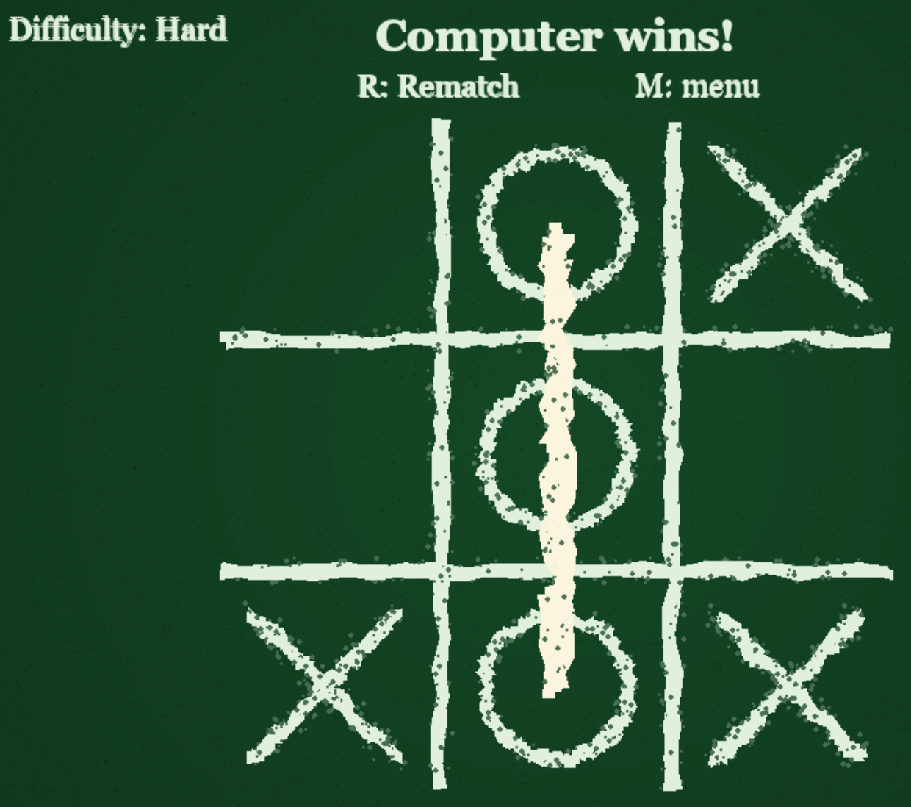

# OXO

A chalkboard-themed Naughts and Crosses (Tic-Tac-Toe) game built with Python and Pygame.



## Features

- Hand-drawn chalkboard visual style with textured background
- Scribble-style X and O marks with subtle randomness
- Three AI difficulty levels:
  - Easy: mostly random play
  - Medium: tactical blocking and winning logic
  - Hard: Minimax-based optimal play
- Keyboard and mouse support for menu and gameplay actions
- Rematch and return-to-menu flow after each game
- Win-line chalk scratch effect for completed winning combos

## Controls

- Main menu:
  - Press 1 for Easy
  - Press 2 for Medium
  - Press 3 for Hard
  - Or click a difficulty option
- In-game:
  - Left-click a cell to place X
  - Press M to return to menu
- Game over:
  - Press R for rematch
  - Press M to return to menu
- Global:
  - Press Esc to quit

## Quickstart

### Windows (venv already present)

1. Activate the virtual environment:

  ```powershell
  .\.venv\Scripts\Activate.ps1
  ```

2. Run the game:

  ```powershell
  python main.py
  ```

### Windows (without activation)

Run directly with the project interpreter:

```powershell
.\.venv\Scripts\python.exe .\main.py
```

### Create a fresh environment (optional)

If you are setting this project up on a new machine:

1. Create a virtual environment:

  ```powershell
  python -m venv .venv
  ```

2. Activate it:

  ```powershell
  .\.venv\Scripts\Activate.ps1
  ```

3. Install dependencies:

  ```powershell
  pip install -r requirements.txt
  ```

4. Run:

  ```powershell
  python main.py
  ```

## Requirements

- Python 3.13+
- Pygame 2.6+

Project dependencies are listed in requirements.txt.

## Debugging in VS Code

A launch profile is included in .vscode/launch.json:

- Run OXO (venv)

Open the Run and Debug view, select that profile, and press F5.

## Gameplay Notes

- The human player is always X and moves first.
- The AI plays O.
- Medium difficulty can miss some deep tactics by design.
- Hard difficulty uses Minimax and should never lose with perfect play.

## Troubleshooting

- If pygame is missing:

  ```powershell
  pip install -r requirements.txt
  ```

- If execution policy blocks activation scripts, run:

  ```powershell
  Set-ExecutionPolicy -Scope Process -ExecutionPolicy RemoteSigned
  ```

- If the window does not appear, ensure no previous Python process is holding SDL resources, then rerun the app.
